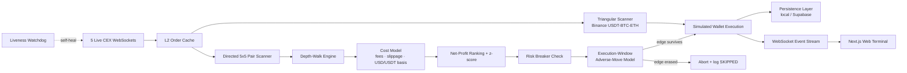

# ₿ Aurex

### EN: Real-Time Bitcoin Cross-Exchange Arbitrage Simulator

### ES: Simulador de Arbitraje de Bitcoin Cross-Exchange en Tiempo Real

Aurex is an institutional-grade, real-time cross-exchange arbitrage simulator. It aggregates live Level 2 (L2) order book depth across five major centralized venues to scan, rank, and simulate execution of risk-hedged arbitrage opportunities net of real-world operational costs and latency.

Aurex es un simulador de arbitraje cross-exchange de grado institucional en tiempo real. Agrega la profundidad del libro de órdenes Nivel 2 (L2) en vivo de cinco de los principales exchanges para escanear, clasificar y simular la ejecución de oportunidades de arbitraje con cobertura de riesgo, netas de costos operativos y latencia reales.

**🔗 Live Dashboard / Panel en Vivo:** [https://aurex-terminal.vercel.app/](https://aurex-terminal.vercel.app/)  
**🔌 Backend API / API de Soporte:** [https://bitcoin-arbitrage-bot.fly.dev/](https://bitcoin-arbitrage-bot.fly.dev/)


---

## 1. What it does | Qué hace

### EN

Aggregates real-time public L2 order books via direct WebSockets, applies mathematical volume sizing to L2 depth walks, simulates executions against off-chain capital reserves, and visualizes live arbitrage flow, trades, risk breaker triggers, and microsecond telemetry on a responsive web console.

### ES

Agrega libros de órdenes L2 públicos en tiempo real mediante WebSockets directos, aplica dimensionamiento matemático de volumen en recorridos de profundidad L2, simula ejecuciones contra reservas de capital off-chain y visualiza flujos de arbitraje en vivo, transacciones, disparadores de breakers de riesgo y telemetría de microsegundos en una consola web responsiva.

---

## 2. Why it matters | Por qué importa

### EN

Most simulators naively calculate spreads using L1 top-of-book prices, ignoring market slippage, exchange fees, and stablecoin basis drift. Aurex models institutional execution reality:

- **L2 Liquidity Depth Walks:** Calculates true Volume-Weighted Average Prices (VWAP) for actual trade sizes.
- **Fully-Loaded Cost Modeling:** Automatically deducts taker fees, network transfer costs, and slippage penalties.
- **Honest USD/USDT Basis:** Charges conversion fees on cross-currency legs (e.g., Coinbase USD vs. Binance USDT) to eliminate phantom spreads.
- **Latency Drift Abort Guard:** Evaluates price movement during routing delays and aborts orders if the edge is erased.

### ES

La mayoría de los simuladores calculan spreads de forma ingenua usando precios L1 (top-of-book), ignorando el deslizamiento, las comisiones y la disparidad del par USD/USDT. Aurex modela la realidad de ejecución institucional:

- **Recorridos de Liquidez L2:** Calcula el Precio Promedio Ponderado por Volumen (VWAP) real para tamaños de operación efectivos.
- **Modelo de Costo Total Integrado:** Deduce automáticamente comisiones taker, costos de retiro de red y penalizaciones por deslizamiento.
- **Base USD/USDT Real:** Aplica comisiones de conversión en cruces de cotización (ej. Coinbase USD vs. Binance USDT) para eliminar spreads fantasmas.
- **Guardia de Aborto por Deriva de Latencia:** Evalúa el movimiento del precio durante el retraso de enrutamiento y aborta órdenes si el margen se desvanece.

---

## 3. Key features | Características clave

### EN

- **Multi-Exchange L2 Feed:** Concurrent WebSocket connections to Binance, Kraken, Coinbase Advanced, OKX, and Bybit.
- **Wire vs. Compute Telemetry:** Separates network transit time (measured from exchange matching engine timestamp) from core engine execution time (microsecond scale).
- **Dual-Strategy Engine:** Scans and ranks both Directed Cross-Exchange spreads (5x5 matrix with rolling z-score confidence) and Binance Triangular Arbitrage (USDT→BTC→ETH→USDT) net of triple fees.
- **Dynamic Risk Circuit Breakers & In-Memory Calibration:** Real-time exposure caps, volatility circuit breakers, and dynamic risk override parameter execution (`POST /api/v1/bot/calibrate`) without container restarts.
- **Real WebSocket Telemetry Stream:** A secondary dedicated WebSocket feed (`/api/v1/telemetry/logs?token=...`) streaming exact network delays, server processing latency, and skipped opportunities.
- **Supabase Immutable Audits:** Stores dynamic audit records inside `copilot_audit_trail` protected by an append-only trigger that completely blocks update and delete actions.
- **Settlement-Style Rebalancing:** Auto-balances exchange inventories via simulated blockchain withdrawals, paying actual network fees.
- **Bilingual Interface:** Toggle languages instantly between English and Español across all UI components and documentation.

### ES

- **Feeds L2 Multi-Exchange:** Conexiones WebSocket concurrentes a Binance, Kraken, Coinbase Advanced, OKX y Bybit.
- **Telemetría de Red vs. Cómputo:** Separa el tiempo de tránsito de red (medido desde el timestamp del motor del exchange) del tiempo de cómputo del motor (escala de microsegundos).
- **Motor de Doble Estrategia:** Escanea y clasifica tanto spreads Cross-Exchange Directos (matriz 5x5 con z-score estadístico) como Arbitraje Triangular en Binance (USDT→BTC→ETH→USDT) neto de tres comisiones.
- **Circuit Breakers y Calibración Dinámica en Memoria:** Límites de exposición, breakers de volatilidad y aplicación dinámica de anulaciones de riesgo (`POST /api/v1/bot/calibrate`) sin reinicios.
- **Transmisión de Telemetría Real por WebSocket:** Canal WebSocket secundario (`/api/v1/telemetry/logs?token=...`) que transmite demoras exactas de red, latencia de motor y trades omitidos.
- **Auditorías Inmutables en Supabase:** Guarda registros de calibración en la tabla `copilot_audit_trail` blindada por un trigger de base de datos que prohíbe modificaciones y eliminaciones.
- **Rebalanceo de Liquidación:** Auto-balancea inventarios de wallets mediante retiros de red simulados, pagando tarifas reales de blockchain.
- **Interfaz Bilingüe:** Cambio de idioma instantáneo entre English y Español en todos los componentes de la interfaz y documentación.

### Interface previews / Previsualización de Interfaz

<table>
  <tr>
    <td align="center"><strong>Dashboard / Panel Principal</strong></td>
    <td align="center"><strong>Opportunities / Oportunidades</strong></td>
  </tr>
  <tr>
    <td></td>
    <td></td>
  </tr>
  <tr>
    <td align="center"><strong>Risk Controls / Controles de Riesgo</strong></td>
    <td align="center"><strong>Trade Ledger / Libro de Órdenes</strong></td>
  </tr>
  <tr>
    <td></td>
    <td></td>
  </tr>
</table>

---

## 4. Architecture | Arquitectura



---

## 5. How it works | Cómo funciona

### EN

1.  **Ingest & Sync:** Venue adapters process L2 delta streams and align order book sequence numbers with REST snapshots.
2.  **Walk & Price:** The engine depth-walks L2 books to calculate executable average prices for the target volume.
3.  **Apply Cost Model:** Taker fees, network costs, slippage penalties, and USD/USDT conversion basis are deducted.
4.  **Size Position:** An optimization loop increments trade volume to maximize net arbitrage yield.
5.  **Statistical Ranking:** Spreads are ranked by net profit; rolling z-scores break near-ties by prioritizing anomalies.
6.  **Drift Assessment:** The execution engine models adverse price movement over delay intervals using realized volatility.
7.  **Commit or Abort:** The trade is executed at post-drift prices if the edge survives; otherwise, it is logged as ABORTED.
8.  **Inventory Rebalancing:** A background loop redistributes funds across venues when assets fall below thresholds.

### ES

1.  **Ingesta y Sincronización:** Los adaptadores procesan deltas L2 y alinean secuencias de libros con snapshots REST.
2.  **Recorrido y Cotización:** El motor recorre los libros L2 para calcular los precios promedio ejecutables para el volumen objetivo.
3.  **Modelo de Costos:** Se deducen comisiones taker, costos de retiro, penalizaciones por deslizamiento y base USD/USDT.
4.  **Dimensionamiento de Posición:** Un bucle de optimización incrementa el volumen para maximizar el rendimiento neto.
5.  **Clasificación Estadística:** Los spreads se ordenan por beneficio neto; z-scores históricos priorizan anomalías estadísticas.
6.  **Evaluación de Deriva:** El motor calcula el movimiento de precio adverso durante la latencia usando la volatilidad realizada.
7.  **Ejecución o Aborto:** La orden se ejecuta a precios post-deriva si el margen sobrevive; de lo contrario, se aborta.
8.  **Rebalanceo de Inventario:** Un proceso en segundo plano redistribuye fondos entre exchanges cuando caen de los límites.

---

## 6. Tech stack | Stack tecnológico

### EN

- **Architecture:** PNPM Workspace Monorepo
- **Backend:** Node.js, Express, Pino (Structured JSON logging), Vitest
- **Frontend:** Next.js 14, Tailwind CSS, Lucide Icons, Recharts (Dynamic charting)
- **Database:** Local JSON File (`db.json`) / Supabase (Cloud Postgres failover)

### ES

- **Arquitectura:** Monorepo con PNPM Workspaces
- **Backend:** Node.js, Express, Pino (Logs estructurados JSON), Vitest
- **Frontend:** Next.js 14, Tailwind CSS, Lucide Icons, Recharts (Gráficos interactivos)
- **Base de Datos:** Archivo JSON Local (`db.json`) / Supabase Postgres (Failover en la nube)

---

## 7. Run locally | Ejecución local

### Installation and Launch / Instalación y Arranque

```bash
# 1. Install dependencies / Instalar dependencias
pnpm install

# 2. Setup configuration files / Configurar archivos de entorno
cp apps/bot/.env.example apps/bot/.env
cp apps/web/.env.local.example apps/web/.env.local

# 3. Start development servers / Iniciar servidores de desarrollo
pnpm dev
```

- **Web Console / Consola Web:** `http://localhost:3000`
- **Bot API / API del Bot:** `http://localhost:3001`

---

## 8. Deployment | Despliegue

### EN

- **Frontend:** Deployed on **Vercel** with monorepo-aware build caching: [https://aurex-terminal.vercel.app/](https://aurex-terminal.vercel.app/)
- **Backend:** Containerized Express application deployed on **Fly.io** near CEX servers.
- **Telemetry DB:** Cloud PostgreSQL managed via **Supabase**.

### ES

- **Frontend:** Desplegado en **Vercel** con caché optimizada para monorepos: [https://aurex-terminal.vercel.app/](https://aurex-terminal.vercel.app/)
- **Backend:** Aplicación Express contenedorizada en **Fly.io** cerca de servidores CEX.
- **Base de Datos:** PostgreSQL en la nube administrado mediante **Supabase**.

---

## 9. Demo notes | Notas de demostración

### EN

- **Coinbase Premium Route:** Run Coinbase Advanced (USD) → Binance (USDT). Observe how the stablecoin basis cost (`ENGINE_USDT_USD_BASIS_BPS`) filters out unhedged, low-margin opportunities.
- **Triangular Arbitrage Panel:** Watch the real-time Binance USDT·BTC·ETH loop. Notice how three layers of taker fees keep most cycles net-negative, illustrating market efficiency.
- **Wire vs. Compute Telemetry:** Compare network wire transit latency (milliseconds) against algorithmic compute time (microseconds).
- **Execution Abort Guard:** Under high volatility, watch the Opportunities ledger for trades logged as `ABORTED AT FILL`—preventing execution when price drift erases the margin.

### ES

- **Ruta Premium de Coinbase:** Ejecuta Coinbase Advanced (USD) → Binance (USDT). Observa cómo el costo de base stablecoin (`ENGINE_USDT_USD_BASIS_BPS`) filtra oportunidades marginales no cubiertas.
- **Panel de Arbitraje Triangular:** Monitorea el ciclo USDT·BTC·ETH en Binance. Nota cómo las tres comisiones de taker mantienen la mayoría de los ciclos negativos, demostrando la eficiencia del mercado.
- **Telemetría Red vs. Cómputo:** Compara la latencia de tránsito de red (milisegundos) frente a la velocidad de cálculo del algoritmo (microsegundos).
- **Guardia de Aborto de Ejecución:** Durante periodos de alta volatilidad, observa trades marcados como `ABORTED AT FILL` en el historial—evitando operar cuando la deriva de precio elimina el margen.

---

## 10. Evaluation Criteria Mapping | Mapeo de Criterios de Evaluación

| Criterion / Criterio                            | Implementation / Implementación                                                                                       |
| :---------------------------------------------- | :-------------------------------------------------------------------------------------------------------------------- |
| **Speed & Efficiency / Velocidad y Eficiencia** | Real-time WebSockets; wire-to-detection latency separate from microsecond compute telemetry.                          |
| **Precision Sizing / Precisión Financiera**     | True L2 depth walks; cost model deducting taker fees, network withdrawals, slippage, and USD/USDT basis.              |
| **Robustness / Robustez**                       | Breaker switches (consecutive loss, volatility, exposure); adverse-selection abort guard; inventory auto-rebalancing. |
| **Intelligence / Estrategia**                   | 5x5 pair scanning matrix with statistical z-score ranking; concurrent Binance triangular loop.                        |
| **Code Quality / Calidad de Código**            | Typed pnpm workspace monorepo; Pino structured logging; 100% Vitest coverage (32/32 tests passed).                    |
| **Presentation / Presentación**                 | Premium reactive Next.js terminal deployed publicly on Vercel.                                                        |

---

## License / Licencia

MIT License. Provided for evaluation, research, and educational simulation purposes.
