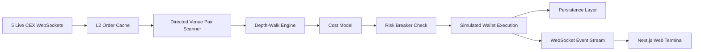

# ₿ Aurex

### Institutional-Grade Bitcoin Cross-Exchange Arbitrage Simulator

Aurex is an institutional-grade platform designed to detect live cross-exchange Bitcoin spreads, model realistic execution costs, and simulate risk-hedged arbitrage trades in real time across five major centralized venues: Binance, Kraken, Coinbase Advanced, OKX, and Bybit.


---

## 1. What it does

Aurex aggregates public real-time Level 2 (L2) order books directly from live exchange WebSockets, processes them through a mathematical volume-sizing core, simulates trades against off-chain mock capital reserves, and visualizes live arbitrage flow, trades, circuit breaker alerts, and telemetry on a real-time web terminal.

## 2. Why it matters

Unlike naive simulators that calculate arbitrary spreads using top-of-book levels alone, Aurex is designed to approximate more realistic execution conditions:

- **Real Depth Walks:** Walks L2 books to derive volume-weighted execution prices.
- **Realistic Cost Deduction:** Deducts VIP-tier taker fees, withdrawal or rebalancing estimates, and slippage.
- **Expected Margin Checks:** Rejects gross-positive spreads that degrade into net-negative returns.
- **Latency Drift Hedges:** Applies configurable latency basis point buffers to reflect market drift during data transit.

## 3. Key features

- **5 Concurrent WS Adapters:** Unified streams for Binance, Kraken, Coinbase, OKX, and Bybit.
- **L2 Sizing Math Core:** Iterative optimization that searches for the trade size that maximizes net yield.
- **Risk Control Panel:** Configurable thresholds with circuit breakers for consecutive loss, volatility, and exposure caps.
- **Dual Persistence Layer:** Seamless failover between zero-config local persistence (`db.json`) and Supabase Postgres.
- **Telemetry Dashboards:** Real-time mean and p99 detection latency plus throughput monitoring.

### Interface previews

<table>
  <tr>
    <td align="center"><strong>Dashboard</strong></td>
    <td align="center"><strong>Opportunities</strong></td>
  </tr>
  <tr>
    <td></td>
    <td></td>
  </tr>
  <tr>
    <td align="center"><strong>Risk Controls</strong></td>
    <td align="center"><strong>Trade Ledger</strong></td>
  </tr>
  <tr>
    <td></td>
    <td></td>
  </tr>
</table>

## 4. Architecture

The platform runs a backend bot responsible for WebSocket market ingestion, L2 depth evaluation, cost-aware sizing, risk checks, and simulated wallet execution, while the frontend consumes the resulting event stream in a live Next.js terminal.



## 5. How it works

1. **Stream:** Exchange adapters maintain active L2 order book caches by reconciling snapshots with incremental delta frames.
2. **Scan:** The engine evaluates directed venue pairs continuously, such as Coinbase → Binance.
3. **Walk:** For each candidate, Aurex walks asks on the cheaper venue and bids on the more expensive venue.
4. **Price:** The engine derives weighted average executable prices from consumed liquidity.
5. **Hedge:** It applies fees, slippage, and latency penalties to estimate net profitability.
6. **Size:** Position size is expanded incrementally until marginal net profit deteriorates.
7. **Commit:** Circuit breakers are checked, simulated wallet balances are updated, and the execution ledger is recorded.

## 6. Tech stack

- **Monorepo:** `pnpm` workspaces with isolated package scopes.
- **Backend Core:** Node.js, Express, Pino, Zod, Vitest.
- **Frontend Web:** Next.js 14, Tailwind CSS, Lucide.
- **Data & Storage:** Local JSON persistence with optional Supabase Postgres escalation.

## 7. Project structure

```bash
.
├── packages/
│   ├── core/         # Shared domain typings and L2 depth-walk math calculators
│   ├── config/       # Environment schemas and static exchange fee parameters
│   └── testing/      # Synthetic book fixtures and mock market data templates
└── apps/
    ├── bot/          # Express API, CEX WebSocket streams, and execution simulator
    └── web/          # Next.js real-time terminal dashboard
```

## 8. Run locally

### Prerequisites

- Node.js v18+
- pnpm v9+

### Installation and launch

```bash
# 1. Install dependencies
pnpm install

# 2. Configure environment files
cp apps/bot/.env.example apps/bot/.env
cp apps/web/.env.local.example apps/web/.env.local

# 3. Start the workspace
pnpm dev
```

- **Dashboard UI:** `http://localhost:3000`
- **Bot API Backend:** `http://localhost:3001`

## 9. Environment variables

### Bot backend (`apps/bot/.env`)

- `PORT`: Server port, default `3001`
- `PERSISTENCE_DRIVER`: `local` or `supabase`
- `API_KEY`: Authorization secret for protected actions
- `SUPABASE_URL`: Supabase project URL
- `SUPABASE_SERVICE_ROLE_KEY`: Supabase service role key

### Web console (`apps/web/.env.local`)

- `NEXT_PUBLIC_BACKEND_URL`: Absolute backend URL, for example `http://localhost:3001`

## 10. Deployment

- **Backend API:** Configured for containerized deployment and compatible with Fly.io or Docker-based hosting.
- **Frontend UI:** Structured for Vercel deployment with monorepo-aware configuration.

## 11. Demo notes

- **Coinbase Premium Route:** Use Coinbase Advanced → Binance to observe real-time USD-denominated spread behavior.
- **Risk Breakers:** Tighten latency or exposure settings in the control panel to trigger cooldown and protection logic.
- **Trade Ledger:** Export simulated executions through the ledger controls.
- **Evaluation Focus:** The main reviewer path is live market state → opportunities → executed trades → cumulative P&L.

## 12. License

MIT License. Provided for evaluation, research, and educational simulation purposes.
