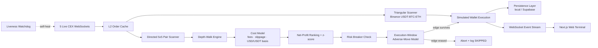

# ₿ Aurex

### Bitcoin Cross-Exchange Arbitrage Simulator

Aurex is a production-style platform designed to detect live cross-exchange Bitcoin spreads, model realistic execution costs, and simulate risk-hedged arbitrage trades in real time across five major centralized venues: Binance, Kraken, Coinbase Advanced, OKX, and Bybit.

**🔗 Live demo:** https://aurex-terminal.vercel.app &nbsp;|&nbsp; **🔌 Backend API:** https://bitcoin-arbitrage-bot.fly.dev


---

## 1. What it does

Aurex aggregates public real-time Level 2 (L2) order books directly from live exchange WebSockets, processes them through a mathematical volume-sizing core, simulates trades against off-chain mock capital reserves, and visualizes live arbitrage flow, trades, circuit breaker alerts, and telemetry on a real-time web terminal.

## 2. Why it matters

Unlike naive simulators that calculate arbitrary spreads using top-of-book levels alone, Aurex is designed to approximate more realistic execution conditions:

- **Real Depth Walks:** Walks L2 books to derive volume-weighted execution prices.
- **Realistic Cost Deduction:** Deducts VIP-tier taker fees, withdrawal/rebalancing estimates, and slippage.
- **Honest USD↔USDT Basis:** Charges a configurable stablecoin-conversion (basis) cost whenever a leg crosses quote currencies, so the well-known "Coinbase premium" (BTC-USD vs BTC-USDT) is never booked as free profit.
- **Expected Margin Checks:** Rejects gross-positive spreads that degrade into net-negative returns.
- **Latency Drift Hedges:** Applies configurable latency basis point buffers to reflect market drift during data transit.

## 3. Key features

- **5 Concurrent WS Adapters:** Unified streams for Binance, Kraken, Coinbase, OKX, and Bybit.
- **Wire vs Compute Latency:** Wire-to-detection latency is measured from each venue's own event timestamp (Binance `E`, OKX `ts`, Bybit `cts`, Kraken level time, Coinbase `timestamp`) to evaluation — an honest end-to-end figure — and reported _separately_ from the pure in-process compute time (microseconds), so network distance never masks how fast the algorithm itself runs.
- **L2 Sizing Math Core:** Iterative optimization that searches for the trade size that maximizes net yield.
- **Two strategies in parallel:**
  - _Directed cross-exchange:_ ranks every simultaneous directed venue pair (5×5) by net profit.
  - _Triangular (single-venue):_ a USDT→BTC→ETH→USDT cycle on Binance, evaluated live net of three taker fees — shown even when correctly skipped below the ~12 bps round-trip fee floor.
- **Statistical Confidence Ranking:** Tracks a rolling z-score of each pair's spread and, among comparably-profitable windows, prioritizes the statistically anomalous (mean-reverting) dislocation over a coincidentally-marginal one.
- **Execution-Window Adverse Selection:** Between detection and fill the market drifts; Aurex prices that adverse move (venue volatility × √latency) at execution time and **aborts** a window whose edge the move would erase — modelling real execution risk, not just a static buffer.
- **Settlement-Style Rebalancing:** Periodically transfers surplus inventory back across venues (paying real withdrawal/stablecoin fees) so directed arbitrage keeps running instead of stalling on a drained reserve.
- **Risk Control Panel:** Configurable thresholds with circuit breakers for consecutive loss, volatility, and exposure caps.
- **Always-On by Design:** An autostart guard resumes the engine on every boot (a restart can never leave it silently paused), and a liveness watchdog force-reconnects any venue that goes silent while still "connected".
- **Dual Persistence Layer:** Seamless failover between zero-config local persistence (`db.json`) and Supabase Postgres.
- **Telemetry Dashboards:** Real-time wire/compute latency, p99, throughput, engine liveness, and execution-abort monitoring.

### Interface previews

<table>
  <tr>
    <td align="center"><strong>Dashboard</strong></td>
    <td align="center"><strong>Opportunities</strong></td>
  </tr>
  <tr>
    <td></td>
    <td></td>
  </tr>
  <tr>
    <td align="center"><strong>Risk Controls</strong></td>
    <td align="center"><strong>Trade Ledger</strong></td>
  </tr>
  <tr>
    <td></td>
    <td></td>
  </tr>
</table>

## 4. Architecture

The platform runs a backend bot responsible for WebSocket market ingestion, L2 depth evaluation, cost-aware sizing, risk checks, and simulated wallet execution, while the frontend consumes the resulting event stream in a live Next.js terminal.



## 5. How it works

1. **Stream:** Exchange adapters maintain active L2 order book caches by reconciling snapshots with incremental delta frames, stamping each book with the venue's own event time for true latency measurement.
2. **Scan:** The engine evaluates directed venue pairs continuously, such as Coinbase → Binance.
3. **Walk:** For each candidate, Aurex walks asks on the cheaper venue and bids on the more expensive venue.
4. **Price:** The engine derives weighted average executable prices from consumed liquidity.
5. **Hedge:** It applies taker fees, slippage, latency penalties and — when the legs cross USD/USDT — a stablecoin basis cost to estimate net profitability. The withdrawal cost is applied once per opportunity.
6. **Size:** Position size is expanded incrementally until marginal net profit deteriorates.
7. **Rank:** Simultaneous windows are ranked by net profit, with a rolling spread z-score breaking near-ties in favour of the statistically more anomalous (mean-reverting) dislocation.
8. **Stress the fill:** After risk approval, the engine prices the adverse price move expected over the modelled execution latency (`executionLatencyMs`) from each venue's realised volatility, re-costs the fill at those prices, and **aborts** if the move erases the edge.
9. **Commit:** Surviving trades update simulated wallet balances at the realised (post-drift) prices, and the execution ledger + P&L are recorded.
10. **Rebalance:** A background loop transfers surplus inventory back across venues (net of withdrawal/stablecoin fees) when any reserve runs low, keeping the simulation solvent and trading.
11. **Triangular (in parallel):** On every Binance tick the engine also evaluates the USDT→BTC→ETH→USDT cycle (and its reverse) net of three taker fees, surfacing the live edge and executing the rare cycle that clears the fee floor.

## 6. Tech stack

- **Monorepo:** `pnpm` workspaces with isolated package scopes.
- **Backend Core:** Node.js, Express, Pino, Zod, Vitest.
- **Frontend Web:** Next.js 14, Tailwind CSS, Lucide.
- **Data & Storage:** Local JSON persistence with optional Supabase Postgres escalation.

## 7. Project structure

```bash
.
├── packages/
│   ├── core/         # Shared domain typings and L2 depth-walk math calculators
│   ├── config/       # Environment schemas and static exchange fee parameters
│   ├── sdk/          # Typed REST and WebSocket client for the bot backend
│   └── testing/      # Synthetic book fixtures and mock market data templates
└── apps/
    ├── bot/          # Express API, CEX WebSocket streams, and execution simulator
    └── web/          # Next.js real-time terminal dashboard
```

## 8. Run locally

### Prerequisites

- Node.js v18+
- pnpm v9+

### Installation and launch

```bash
# 1. Install dependencies
pnpm install

# 2. Configure environment files
cp apps/bot/.env.example apps/bot/.env
cp apps/web/.env.local.example apps/web/.env.local

# 3. Start the workspace
pnpm dev
```

- **Dashboard UI:** `http://localhost:3000`
- **Bot API Backend:** `http://localhost:3001`

## 9. Environment variables

### Bot backend (`apps/bot/.env`)

- `PORT`: Server port, default `3001`
- `PERSISTENCE_DRIVER`: `local` or `supabase`
- `API_KEY`: Authorization secret for protected actions
- `SUPABASE_URL`: Supabase project URL
- `SUPABASE_SERVICE_ROLE_KEY`: Supabase service role key
- `ENGINE_USDT_USD_BASIS_BPS`: Cost (bps) charged on legs that cross USD↔USDT, modelling the stablecoin conversion needed to realize a Coinbase/Kraken (USD) vs Binance/OKX/Bybit (USDT) spread. Default `3` (≈ realistic USDC/USDT conversion cost); set `0` to treat USD≈USDT 1:1.
- `ENGINE_EXECUTION_LATENCY_MS`: Modeled order-routing-to-fill latency (ms) over which adverse price drift is priced and an edge-erasing window is aborted. Default `75`.
- `ENGINE_AUTOSTART`: When `true` (default), the engine boots unpaused regardless of any persisted pause flag, so a restart/redeploy always resumes the live demo. Set `false` to honour a persisted pause across restarts.

### Web console (`apps/web/.env.local`)

- `NEXT_PUBLIC_BACKEND_URL`: Absolute backend URL, for example `http://localhost:3001`

## 10. Deployment

- **Backend API:** Configured for containerized deployment and compatible with Fly.io or Docker-based hosting.
- **Frontend UI:** Structured for Vercel deployment with monorepo-aware configuration.

## 11. Runtime topology

- **Frontend:** Next.js terminal deployed on Vercel — [https://aurex-terminal.vercel.app/](https://aurex-terminal.vercel.app/)
- **Backend bot:** Market ingestion, opportunity scanning, and execution simulation deployed on Fly.io.
- **Persistence:** Local JSON fallback for zero-config mode, with optional Supabase Postgres persistence.
- **Transport:** The frontend consumes backend state and execution events through the live backend interface.

## 12. Integration surface

Aurex is structured around a standalone backend bot and a separate web terminal client.

Potential integration points include:

- backend REST endpoints for operational controls,
- live event streaming for opportunities and executions,
- and persistence-backed trade history export flows.

## 13. Design decisions & market-efficiency findings

A core finding drove the design: **naive top-of-book arbitrage between major BTC venues is almost always net-negative after costs.** The big spot venues are brutally efficient — same-quote (USDT) books on Binance/OKX/Bybit rarely diverge beyond the combined ~9-10 bps taker fees, and the one persistent dislocation (the **Coinbase USD premium** vs USDT venues) collapses once you charge the real USD↔USDT conversion (basis) cost. Aurex is built to _prove_ this rather than hide it:

- **It rejects, transparently.** Every gross-positive-but-net-negative window is logged as `SKIPPED` with the exact reason and figures, so the cost model is auditable — not a black box that quietly never trades.
- **It only executes genuine edge.** A trade fires only when net profit clears `minNetProfitUSD` after fees + withdrawal + slippage + latency + cross-quote basis.
- **It quantifies conviction.** A rolling per-pair spread z-score separates a statistically anomalous (mean-reverting) dislocation from a coincidentally-marginal one.

This is the honest version of the challenge's own example: a $250 gross spread looks like free money until you net it — and our feed shows you exactly when it isn't.

### Evaluation-criteria mapping

| Criterion                       | Where it lives                                                                                                                                                                                                                                                                                                                                           |
| ------------------------------- | -------------------------------------------------------------------------------------------------------------------------------------------------------------------------------------------------------------------------------------------------------------------------------------------------------------------------------------------------------- |
| **Speed / latency**             | Real WS L2 feeds (Binance diff-depth, Kraken book-10, OKX books5, Bybit orderbook.50, Coinbase level2); wire-to-detection latency from each venue's own event stamp **plus** a separate sub-millisecond compute-latency metric (`detectionLatencyMs`, `p99LatencyMs`, `computeLatencyMs`, `evalsPerSecond`).                                             |
| **Net-profitability precision** | `calculateNetSpread` deducts taker fees, withdrawal, slippage, latency buffer and the USD↔USDT basis; the L2 depth-walk prices real slippage; an execution-window adverse-move model re-costs the fill; rejected/aborted windows are logged with reasons.                                                                                                |
| **Robustness**                  | Order-book sequence/checksum validation, partial-fill depth-walking, circuit breakers (consecutive loss, volatility spike, exposure caps), execution-window adverse-move abort guard, settlement-style inventory rebalancing, an autostart guard + liveness watchdog (silent-feed self-heal), and a bootstrap that binds even if a venue is unreachable. |
| **Strategy / intelligence**     | Two strategies: directed 5×5 cross-exchange ranking with a statistical z-score tiebreaker, **and** a single-venue triangular cycle (USDT→BTC→ETH→USDT) priced net of three taker fees.                                                                                                                                                                   |
| **Architecture / code quality** | Typed `pnpm` monorepo, shared `@arbitrage/*` packages, Zod validation, Pino structured logging, Vitest unit + integration suites (incl. triangular & execution-slippage math), and GitHub Actions CI.                                                                                                                                                    |
| **Web presentation**            | Real-time terminal: live books, ranked opportunities (with z-score), triangular panel, executed-trade ledger, cumulative P&L/equity curve, wire/compute latency, engine-liveness, risk panel, and event feed — deployed publicly.                                                                                                                        |

## 14. Demo notes

- **Coinbase Premium Route:** Use Coinbase Advanced → Binance to observe the real USD vs USDT dislocation. Note that Aurex charges a stablecoin **basis cost** on this route (`ENGINE_USDT_USD_BASIS_BPS`), so a wide gross premium is only executed when it survives the conversion cost — by design, marginal cross-quote windows show up as transparently SKIPPED rather than as phantom profit.
- **Statistical Confidence:** The Opportunities table shows a per-window z-score (σ); higher values flag dislocations that are unusually wide versus their own recent history.
- **Triangular Panel:** The Dashboard's Triangular Arbitrage card shows the live Binance USDT·BTC·ETH cycle — its three legs, gross edge, ~12 bps fee drag, and net edge — illustrating why a single-venue cycle is almost always correctly below the fee floor.
- **Wire vs Compute:** The header and Health page show wire-to-detection latency (network-bound) next to the sub-millisecond compute time, so the speed of the algorithm itself is visible independent of the fra→US/Asia network distance.
- **Execution Aborts:** When recent volatility is high, watch the Opportunities feed for windows `SKIPPED` with an "aborted at fill" reason and the Health banner's Fill Aborts counter — adverse movement during the fill window wiped the edge.
- **Inventory Rebalancing:** Watch the Health event feed for `REBALANCE` entries — the engine moves surplus inventory across venues (paying fees) so it never stalls on a drained reserve.
- **Risk Breakers:** Tighten latency or exposure settings in the control panel to trigger cooldown and protection logic.
- **Trade Ledger:** Export simulated executions through the ledger controls.
- **Evaluation Focus:** The main reviewer path is live market state → opportunities → executed trades → cumulative P&L.

## 15. License

MIT License. Provided for evaluation, research, and educational simulation purposes.
