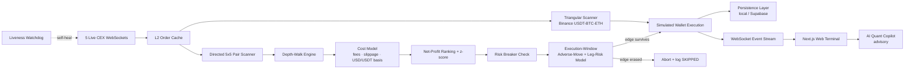

# ₿ Aurex

### EN: Real-Time Bitcoin Cross-Exchange Arbitrage Simulator

### ES: Simulador de Arbitraje de Bitcoin Cross-Exchange en Tiempo Real

> **Updated / Actualizado: 18 June 2026 / 18 de junio de 2026.**
> This document describes the **live deployed system**. The repository submitted for judging is frozen at commit [`9eb95a4`](https://github.com/Eras256/Aurex/commit/9eb95a4); every engineering change the live system carries on top of that frozen submission is listed in [§10 Post-Freeze Delta](#10-post-freeze-delta--cambios-posteriores-al-congelamiento) so reviewers can reconcile the two.
>
> Este documento describe el **sistema en vivo desplegado**. El repositorio enviado a evaluación está congelado en el commit [`9eb95a4`](https://github.com/Eras256/Aurex/commit/9eb95a4); cada cambio de ingeniería que el sistema en vivo lleva sobre esa entrega congelada está listado en [§10 Delta Posterior al Congelamiento](#10-post-freeze-delta--cambios-posteriores-al-congelamiento) para que el jurado pueda reconciliar ambos.

Aurex is an institutional-grade, real-time cross-exchange arbitrage simulator. It aggregates live Level 2 (L2) order book depth across five major centralized venues to scan, rank, and simulate execution of risk-hedged arbitrage opportunities net of real-world operational costs and latency.

Aurex es un simulador de arbitraje cross-exchange de grado institucional en tiempo real. Agrega la profundidad del libro de órdenes Nivel 2 (L2) en vivo de cinco de los principales exchanges para escanear, clasificar y simular la ejecución de oportunidades de arbitraje con cobertura de riesgo, netas de costos operativos y latencia reales.

**🔗 Live Dashboard / Panel en Vivo:** [https://aurex-terminal.vercel.app/](https://aurex-terminal.vercel.app/)
**🔌 Backend API / API de Soporte:** [https://bitcoin-arbitrage-bot.fly.dev/](https://bitcoin-arbitrage-bot.fly.dev/)


---

## 1. What it does | Qué hace

### EN

Aggregates real-time public L2 order books via direct WebSockets, applies mathematical volume sizing to L2 depth walks, simulates executions against off-chain capital reserves, and visualizes live arbitrage flow, trades, risk breaker triggers, and microsecond telemetry on a responsive web console. Fills are drawn stochastically around the modeled adverse cost, so the simulation reports an honest, sub-100% win rate rather than a flattering ideal.

### ES

Agrega libros de órdenes L2 públicos en tiempo real mediante WebSockets directos, aplica dimensionamiento matemático de volumen en recorridos de profundidad L2, simula ejecuciones contra reservas de capital off-chain y visualiza flujos de arbitraje en vivo, transacciones, disparadores de breakers de riesgo y telemetría de microsegundos en una consola web responsiva. Los llenados se sortean de forma estocástica alrededor del coste adverso modelado, por lo que la simulación reporta un win rate honesto y por debajo del 100%, no un ideal favorecedor.

---

## 2. Why it matters | Por qué importa

### EN

Most simulators naively calculate spreads using L1 top-of-book prices, ignoring market slippage, exchange fees, and stablecoin basis drift. Aurex models institutional execution reality:

- **L2 Liquidity Depth Walks:** Calculates true Volume-Weighted Average Prices (VWAP) for actual trade sizes.
- **Fully-Loaded Cost Modeling:** Automatically deducts taker fees, network transfer costs, and slippage penalties.
- **Honest USD/USDT Basis:** Charges conversion fees on cross-currency legs (e.g., Coinbase USD vs. Binance USDT) to eliminate phantom spreads.
- **Latency Drift Abort Guard:** Evaluates price movement during routing delays and aborts orders if the edge is erased.
- **Cross-Venue Leg Risk:** Models the dominant real-world loss source — a filled leg whose hedge misses — so reported P&L reflects genuine execution risk, not an idealized fill.

### ES

La mayoría de los simuladores calculan spreads de forma ingenua usando precios L1 (top-of-book), ignorando el deslizamiento, las comisiones y la disparidad del par USD/USDT. Aurex modela la realidad de ejecución institucional:

- **Recorridos de Liquidez L2:** Calcula el Precio Promedio Ponderado por Volumen (VWAP) real para tamaños de operación efectivos.
- **Modelo de Costo Total Integrado:** Deduce automáticamente comisiones taker, costos de retiro de red y penalizaciones por deslizamiento.
- **Base USD/USDT Real:** Aplica comisiones de conversión en cruces de cotización (ej. Coinbase USD vs. Binance USDT) para eliminar spreads fantasmas.
- **Guardia de Aborto por Deriva de Latencia:** Evalúa el movimiento del precio durante el retraso de enrutamiento y aborta órdenes si el margen se desvanece.
- **Riesgo de Pata Cross-Venue:** Modela la principal fuente de pérdida del mundo real — una pata llenada cuya cobertura falla — para que el P&L refleje riesgo de ejecución genuino y no un llenado idealizado.

---

## 3. Key features | Características clave

### EN

- **Multi-Exchange L2 Feed:** Concurrent WebSocket connections to Binance, Kraken, Coinbase Advanced, OKX, and Bybit.
- **Wire vs. Compute Telemetry:** Separates network transit time (measured from exchange matching engine timestamp) from core engine execution time (microsecond scale), with a p99 detection-latency metric in the header ticker.
- **Dual-Strategy Engine:** Scans and ranks both Directed Cross-Exchange spreads (5x5 matrix with rolling z-score statistical-arbitrage confidence) and Binance Triangular Arbitrage (USDT→BTC→ETH→USDT) net of triple fees.
- **Execution Realism:** Stochastic two-sided fill drift (Box–Muller) around the modeled adverse cost; cross-venue leg-execution risk; a 60s per-pair execution cooldown so cumulative returns are realistic; and transparently-surfaced SKIPPED windows.
- **Dynamic Risk Circuit Breakers & In-Memory Calibration:** Real-time exposure caps, volatility circuit breakers, consecutive-loss cooldown, and dynamic risk override parameter execution (`POST /api/v1/bot/calibrate`) without container restarts.
- **AI Quant Copilot Layer:** A Copilot workspace plus an engine settings modal with provider/model selection (advisory only; simulated by default), surfacing spread explainability and execution-cost attribution from live telemetry.
- **Real WebSocket Telemetry Stream:** A secondary dedicated WebSocket feed (`/api/v1/telemetry/logs?token=...`) streaming exact network delays, server processing latency, and skipped opportunities.
- **Supabase Immutable Audits:** Stores dynamic audit records inside `copilot_audit_trail` protected by an append-only trigger that completely blocks update and delete actions.
- **Reliability & Self-Heal:** Always-on engine guard and liveness watchdog with self-heal recovery counting; Binance resync-storm fix; honest Sharpe ratio withheld until at least 20 trades exist.
- **Settlement-Style Rebalancing:** Auto-balances exchange inventories via simulated blockchain withdrawals, paying actual network fees.
- **Bilingual Interface:** Toggle languages instantly between English and Español across all UI components and documentation.

### ES

- **Feeds L2 Multi-Exchange:** Conexiones WebSocket concurrentes a Binance, Kraken, Coinbase Advanced, OKX y Bybit.
- **Telemetría de Red vs. Cómputo:** Separa el tiempo de tránsito de red (medido desde el timestamp del motor del exchange) del tiempo de cómputo del motor (escala de microsegundos), con métrica p99 de latencia de detección en el ticker de cabecera.
- **Motor de Doble Estrategia:** Escanea y clasifica tanto spreads Cross-Exchange Directos (matriz 5x5 con z-score móvil de arbitraje estadístico) como Arbitraje Triangular en Binance (USDT→BTC→ETH→USDT) neto de tres comisiones.
- **Realismo de Ejecución:** Deriva de llenado estocástica de dos colas (Box–Muller) alrededor del coste adverso modelado; riesgo de ejecución por pata cross-venue; cooldown de ejecución por par de 60s para que los retornos acumulados sean realistas; y ventanas SKIPPED expuestas con transparencia.
- **Circuit Breakers y Calibración Dinámica en Memoria:** Límites de exposición, breakers de volatilidad, cooldown por pérdidas consecutivas y aplicación dinámica de anulaciones de riesgo (`POST /api/v1/bot/calibrate`) sin reinicios.
- **Capa de AI Quant Copilot:** Espacio de trabajo del Copiloto más un modal de ajustes del motor con selección de proveedor/modelo (solo consultivo; simulado por defecto), que expone explicabilidad del spread y atribución de costes de ejecución desde telemetría en vivo.
- **Transmisión de Telemetría Real por WebSocket:** Canal WebSocket secundario (`/api/v1/telemetry/logs?token=...`) que transmite demoras exactas de red, latencia de motor y trades omitidos.
- **Auditorías Inmutables en Supabase:** Guarda registros de calibración en la tabla `copilot_audit_trail` blindada por un trigger de base de datos que prohíbe modificaciones y eliminaciones.
- **Fiabilidad y Auto-Recuperación:** Guardia de motor siempre activo y watchdog de liveness con conteo de auto-recuperación; corrección de tormenta de resync en Binance; Sharpe honesto retenido hasta tener al menos 20 operaciones.
- **Rebalanceo de Liquidación:** Auto-balancea inventarios de wallets mediante retiros de red simulados, pagando tarifas reales de blockchain.
- **Interfaz Bilingüe:** Cambio de idioma instantáneo entre English y Español en todos los componentes de la interfaz y documentación.

### Interface previews / Previsualización de Interfaz

<table>
  <tr>
    <td align="center"><strong>Dashboard / Panel Principal</strong></td>
    <td align="center"><strong>Opportunities / Oportunidades</strong></td>
  </tr>
  <tr>
    <td></td>
    <td></td>
  </tr>
  <tr>
    <td align="center"><strong>Risk Controls / Controles de Riesgo</strong></td>
    <td align="center"><strong>Trade Ledger / Libro de Órdenes</strong></td>
  </tr>
  <tr>
    <td></td>
    <td></td>
  </tr>
</table>

---

## 4. Architecture | Arquitectura



---

## 5. How it works | Cómo funciona

### EN

1.  **Ingest & Sync:** Venue adapters process L2 delta streams and align order book sequence numbers with REST snapshots.
2.  **Walk & Price:** The engine depth-walks L2 books to calculate executable average prices for the target volume.
3.  **Apply Cost Model:** Taker fees, network costs, slippage penalties, and USD/USDT conversion basis are deducted.
4.  **Size Position:** An optimization loop increments trade volume to maximize net arbitrage yield.
5.  **Statistical Ranking:** Spreads are ranked by net profit; rolling z-scores break near-ties by prioritizing anomalies.
6.  **Drift & Leg-Risk Assessment:** The execution engine models adverse price movement over delay intervals using realized volatility, and applies cross-venue leg-execution risk where a hedge can miss.
7.  **Commit or Abort:** The trade is executed at post-drift prices if the edge survives; otherwise, it is logged as ABORTED/SKIPPED. A 60s per-pair cooldown prevents re-firing the same dislocation every tick.
8.  **Inventory Rebalancing:** A background loop redistributes funds across venues when assets fall below thresholds, paying simulated network fees.

### ES

1.  **Ingesta y Sincronización:** Los adaptadores procesan deltas L2 y alinean secuencias de libros con snapshots REST.
2.  **Recorrido y Cotización:** El motor recorre los libros L2 para calcular los precios promedio ejecutables para el volumen objetivo.
3.  **Modelo de Costos:** Se deducen comisiones taker, costos de retiro, penalizaciones por deslizamiento y base USD/USDT.
4.  **Dimensionamiento de Posición:** Un bucle de optimización incrementa el volumen para maximizar el rendimiento neto.
5.  **Clasificación Estadística:** Los spreads se ordenan por beneficio neto; z-scores históricos priorizan anomalías estadísticas.
6.  **Evaluación de Deriva y Riesgo de Pata:** El motor calcula el movimiento de precio adverso durante la latencia usando la volatilidad realizada, y aplica riesgo de ejecución por pata cross-venue donde una cobertura puede fallar.
7.  **Ejecución o Aborto:** La orden se ejecuta a precios post-deriva si el margen sobrevive; de lo contrario, se aborta/SKIPPED. Un cooldown de 60s por par evita re-disparar la misma dislocación en cada tick.
8.  **Rebalanceo de Inventario:** Un proceso en segundo plano redistribuye fondos entre exchanges cuando caen de los límites, pagando tarifas de red simuladas.

---

## 6. Tech stack | Stack tecnológico

### EN

- **Architecture:** PNPM Workspace Monorepo
- **Backend:** Node.js, Express, Pino (Structured JSON logging), Vitest
- **Frontend:** Next.js 14, Tailwind CSS, Lucide Icons, Recharts (Dynamic charting)
- **Database:** Local JSON File (`db.json`) / Supabase (Cloud Postgres failover)

### ES

- **Arquitectura:** Monorepo con PNPM Workspaces
- **Backend:** Node.js, Express, Pino (Logs estructurados JSON), Vitest
- **Frontend:** Next.js 14, Tailwind CSS, Lucide Icons, Recharts (Gráficos interactivos)
- **Base de Datos:** Archivo JSON Local (`db.json`) / Supabase Postgres (Failover en la nube)

---

## 7. Run locally | Ejecución local

### Installation and Launch / Instalación y Arranque

```bash
# 1. Install dependencies / Instalar dependencias
pnpm install

# 2. Setup configuration files / Configurar archivos de entorno
cp apps/bot/.env.example apps/bot/.env
cp apps/web/.env.local.example apps/web/.env.local

# 3. Start development servers / Iniciar servidores de desarrollo
pnpm dev
```

- **Web Console / Consola Web:** `http://localhost:3000`
- **Bot API / API del Bot:** `http://localhost:3001`

---

## 8. Deployment | Despliegue

### EN

- **Frontend:** Deployed on **Vercel** with monorepo-aware build caching: [https://aurex-terminal.vercel.app/](https://aurex-terminal.vercel.app/)
- **Backend:** Containerized Express application deployed on **Fly.io** near CEX servers.
- **Telemetry DB:** Cloud PostgreSQL managed via **Supabase**.

### ES

- **Frontend:** Desplegado en **Vercel** con caché optimizada para monorepos: [https://aurex-terminal.vercel.app/](https://aurex-terminal.vercel.app/)
- **Backend:** Aplicación Express contenedorizada en **Fly.io** cerca de servidores CEX.
- **Base de Datos:** PostgreSQL en la nube administrado mediante **Supabase**.

---

## 9. Demo notes | Notas de demostración

### EN

- **Coinbase Premium Route:** Run Coinbase Advanced (USD) → Binance (USDT). Observe how the stablecoin basis cost (`ENGINE_USDT_USD_BASIS_BPS`) filters out unhedged, low-margin opportunities.
- **Triangular Arbitrage Panel:** Watch the real-time Binance USDT·BTC·ETH loop. Notice how three layers of taker fees keep most cycles net-negative, illustrating market efficiency.
- **Wire vs. Compute Telemetry:** Compare network wire transit latency (milliseconds) against algorithmic compute time (microseconds).
- **Execution Abort Guard & Leg Risk:** Under high volatility, watch the Opportunities ledger for trades logged as `ABORTED AT FILL` and the occasional leg-miss unwound at a loss — the reason the win rate sits honestly below 100%.

### ES

- **Ruta Premium de Coinbase:** Ejecuta Coinbase Advanced (USD) → Binance (USDT). Observa cómo el costo de base stablecoin (`ENGINE_USDT_USD_BASIS_BPS`) filtra oportunidades marginales no cubiertas.
- **Panel de Arbitraje Triangular:** Monitorea el ciclo USDT·BTC·ETH en Binance. Nota cómo las tres comisiones de taker mantienen la mayoría de los ciclos negativos, demostrando la eficiencia del mercado.
- **Telemetría Red vs. Cómputo:** Compara la latencia de tránsito de red (milisegundos) frente a la velocidad de cálculo del algoritmo (microsegundos).
- **Guardia de Aborto y Riesgo de Pata:** Durante alta volatilidad, observa trades marcados como `ABORTED AT FILL` y la ocasional pata fallida deshecha con pérdida — la razón por la que el win rate queda honestamente por debajo del 100%.

---

## 10. Post-Freeze Delta | Cambios Posteriores al Congelamiento

### EN

The judged submission is frozen at commit [`9eb95a4`](https://github.com/Eras256/Aurex/commit/9eb95a4). During the additional public-deployment window the live system continued to iterate. The full, honest list below (also surfaced in-app on the **Build Notes** page) is what the live deployment carries on top of the frozen submission, so the two can be reconciled.

**Execution realism & honest metrics**

- Stochastic two-sided fill drift (Box–Muller) around the modeled adverse cost, so the win rate is no longer a perfect 100%.
- Cross-venue leg-execution risk: a fraction of approved trades fill one leg and miss the other, unwinding at a realised loss — the dominant real-world loss source.
- Per-pair execution cooldown (60s): a captured dislocation is not re-fired every tick, keeping cumulative returns realistic.
- SKIPPED window surfacing: sub-threshold venue pairs are recorded as transparently rejected even on executing cycles, and the feed is status-balanced.

**Strategy intelligence**

- Single-venue triangular arbitrage on Binance (USDT → BTC → ETH), net of three taker fees.
- Statistical-arbitrage ranking: a rolling z-score per venue pair prioritises the most anomalous, mean-reverting dislocations.

**Execution & latency modelling**

- Adverse price-movement model during the fill window, scaled by volatility × √time.
- Pure compute latency separated from wire latency, with a p99 detection-latency metric in the header ticker.

**AI Quant Copilot layer**

- Copilot workspace and engine settings modal with provider/model selection (advisory only; simulated by default).
- Spread explainability and execution-cost attribution surfaced from live telemetry.

**Reliability & operations**

- Always-on engine guard and liveness watchdog with self-heal recovery counting.
- Honest Sharpe ratio: withheld until at least 20 trades exist, rendered as "Calculating n/20".
- Binance resync-storm fix (reconnect on persistent desync) and persistence honesty (report missing cloud state instead of masquerading defaults).
- Real Supabase audit trail, dynamic risk-calibration API, and a live WebSocket telemetry stream.

**Interface & localisation**

- Full English/Spanish localisation across the terminal, plus responsive fixes (mobile bottom-sheet modal, header ticker, overflow tables).
- Markets grid and spread matrix across the 5 venues, wallet/CEX coverage view, logo-to-home links and repositioned language selectors.

**Tests & quality**

- Integration test suite for the Express bot API (HTTP routes, secure-guard auth, calibration and audit endpoints) on top of the existing unit tests — 46 bot tests (30 unit + 16 integration) plus 13 SDK tests, 59 passing in total — alongside the Playwright E2E suite.

**Documentation & legal**

- Bilingual README rewrite, technical paper, operational runbook and AI Copilot phase roadmaps; absolute claims softened for technical honesty.
- Aurex-specific Terms & Privacy plus the official Coding Challenge Mexico policy pages, routed from the footer.

**Tooling, CI & refactors**

- CI workflow YAML fix, removal of dead i18n scaffolding, elimination of `any` types for stricter typing, and assorted build/config cleanups.

### ES

La entrega evaluada está congelada en el commit [`9eb95a4`](https://github.com/Eras256/Aurex/commit/9eb95a4). Durante la ventana adicional de publicación, el sistema en vivo siguió iterando. La lista completa y honesta de abajo (también visible dentro de la app en la página **Build Notes**) es lo que el despliegue en vivo lleva sobre la entrega congelada, para poder reconciliar ambos.

**Realismo de ejecución y métricas honestas**

- Deriva de llenado estocástica de dos colas (Box–Muller) alrededor del coste adverso modelado, por lo que el win rate ya no es un 100% perfecto.
- Riesgo de ejecución por pata cross-venue: una fracción de operaciones aprobadas llena una pata y falla la otra, deshaciéndose con pérdida real — la principal fuente de pérdida del mundo real.
- Cooldown de ejecución por par (60s): una dislocación capturada no se re-dispara en cada tick, manteniendo retornos acumulados realistas.
- Exposición de ventanas SKIPPED: los pares sub-umbral se registran como rechazados transparentes incluso en ciclos que ejecutan, con el feed balanceado por estado.

**Inteligencia de estrategia**

- Arbitraje triangular de un solo venue en Binance (USDT → BTC → ETH), neto de tres comisiones taker.
- Ranking de arbitraje estadístico: un z-score móvil por par de venues prioriza las dislocaciones más anómalas y reversibles.

**Modelado de ejecución y latencia**

- Modelo de movimiento adverso del precio durante la ventana de llenado, escalado por volatilidad × √tiempo.
- Latencia de cómputo puro separada de la latencia de red, con métrica p99 de latencia de detección en el ticker de cabecera.

**Capa de AI Quant Copilot**

- Espacio de trabajo del Copiloto y modal de ajustes del motor con selección de proveedor/modelo (solo consultivo; simulado por defecto).
- Explicabilidad del spread y atribución de costes de ejecución a partir de telemetría en vivo.

**Fiabilidad y operación**

- Guardia de motor siempre activo y watchdog de liveness con conteo de auto-recuperación.
- Sharpe honesto: se retiene hasta tener al menos 20 operaciones, mostrado como "Calculando n/20".
- Corrección de tormenta de resync en Binance (reconexión ante desync persistente) y honestidad de persistencia (reportar estado de nube ausente en vez de enmascarar valores por defecto).
- Audit trail real en Supabase, API de calibración dinámica de riesgo y stream de telemetría por WebSocket en vivo.

**Interfaz y localización**

- Localización completa inglés/español en todo el terminal, más correcciones responsivas (modal bottom-sheet móvil, ticker de cabecera, tablas con overflow).
- Grid de mercados y matriz de spreads en los 5 venues, vista de cobertura wallets/CEX, logos enlazados al inicio y selectores de idioma reposicionados.

**Pruebas y calidad**

- Suite de pruebas de integración para la API del bot en Express (rutas HTTP, auth con secure-guard, endpoints de calibración y auditoría) sobre las pruebas unitarias existentes — 46 pruebas del bot (30 unit + 16 integración) más 13 del SDK, 59 en verde en total — junto con la suite Playwright E2E.

**Documentación y legal**

- Reescritura bilingüe del README, paper técnico, runbook operativo y roadmaps de fase del Copiloto IA; afirmaciones absolutas suavizadas por honestidad técnica.
- Términos y Privacidad propios de Aurex más las páginas oficiales de política de Coding Challenge Mexico, enrutadas desde el pie de página.

**Tooling, CI y refactors**

- Corrección de YAML del workflow de CI, eliminación de andamiaje i18n muerto, supresión de tipos `any` para tipado más estricto y limpiezas varias de build/config.

---

## 11. Evaluation Criteria Mapping | Mapeo de Criterios de Evaluación

| Criterion / Criterio                            | Implementation / Implementación                                                                                                                              |
| :---------------------------------------------- | :----------------------------------------------------------------------------------------------------------------------------------------------------------- |
| **Speed & Efficiency / Velocidad y Eficiencia** | Real-time WebSockets; wire-to-detection latency separate from microsecond compute telemetry, with a p99 metric.                                              |
| **Precision Sizing / Precisión Financiera**     | True L2 depth walks; cost model deducting taker fees, network withdrawals, slippage, and USD/USDT basis.                                                     |
| **Robustness / Robustez**                       | Breaker switches (consecutive loss, volatility, exposure); adverse-selection abort guard; leg-execution risk; inventory auto-rebalancing; liveness watchdog. |
| **Intelligence / Estrategia**                   | 5x5 pair scanning matrix with statistical z-score ranking; concurrent Binance triangular loop; AI Quant Copilot advisory.                                    |
| **Code Quality / Calidad de Código**            | Typed pnpm workspace monorepo; Pino structured logging; 59 passing Vitest tests (46 bot unit + integration, 13 SDK), plus Playwright E2E.                    |
| **Presentation / Presentación**                 | Premium reactive bilingual Next.js terminal deployed publicly on Vercel.                                                                                     |

---

## License / Licencia

MIT License. Provided for evaluation, research, and educational simulation purposes.
